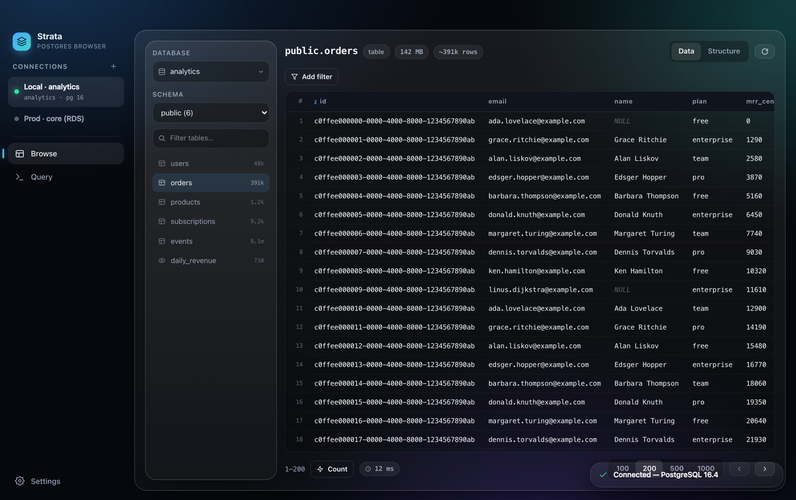
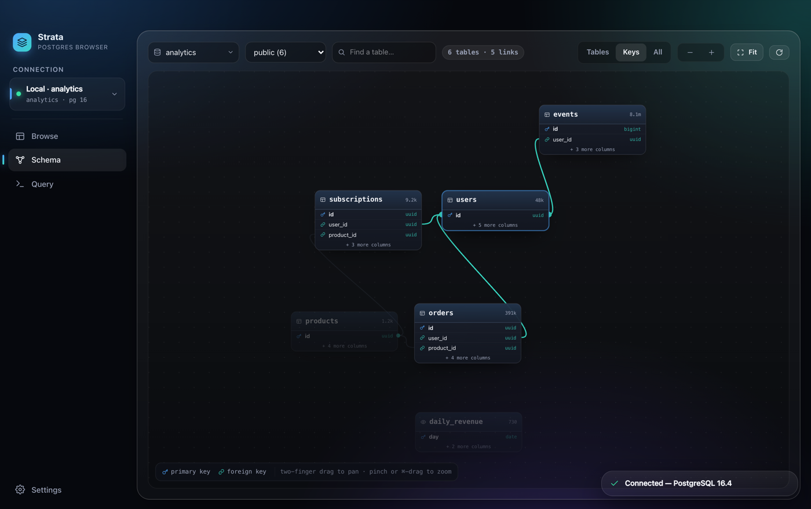
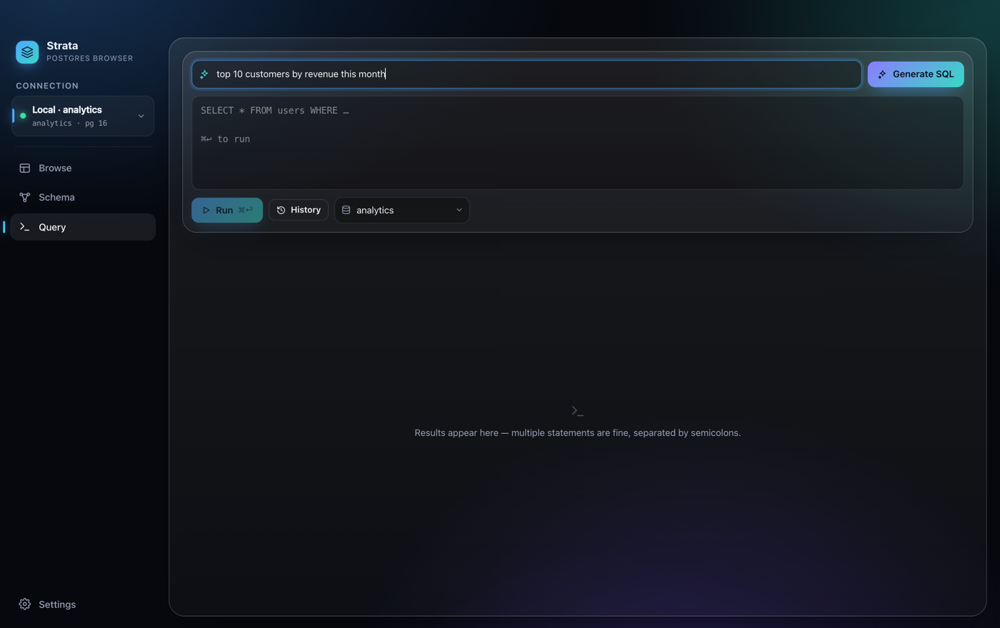

<div align="center">


# Strata

**A native macOS Postgres browser — the fast counterpart to pgAdmin.**

Connect, click a table, and see your data instantly: filter, sort and page
without writing SQL — with an interactive schema map, a full SQL editor and
natural-language → SQL one tab away.

[](https://github.com/benoneill66/strata/releases/latest)
&nbsp;

&nbsp;
[](https://buymeacoffee.com/benoneill)



</div>

## Install

**[⬇︎ Download the latest `.dmg`](https://github.com/benoneill66/strata/releases/latest)** — universal, runs on both Intel and Apple Silicon Macs.

1. Open the `.dmg` and drag **Strata** into **Applications**.
2. First launch only — the app isn't signed with an Apple Developer ID yet, so
   clear the quarantine flag once:
   ```sh
   xattr -cr /Applications/Strata.app
   ```
   *(or right-click Strata → **Open** → **Open**).* After that, just double-click it.

## Features

- **Connections** — saved profiles (host, user, database, SSL mode) live in a
  persistent sidebar rail, shared across Browse and Query. One-click connect with
  a built-in connection test; multiple live servers at once.
- **Browse** — schema/table tree with row estimates, an instant data grid with
  column sorting, stackable filters (contains / = / ≠ / ranges / null), exact
  counts on demand, pagination, a structure tab (types, PKs, defaults) and a
  row-detail drawer with copy-as-JSON.
- **Edit** — tables with a primary key are editable in place: double-click a
  cell to change it (with one-tap NULL). Edits stage locally — highlighted
  amber until you hit Save (⌘S) — then land together in a single transaction
  that rolls back entirely unless every row matches exactly once. Add rows
  from a column-aware drawer that knows defaults and nullability; delete rows
  from the detail drawer.
- **Schema** — an interactive ER diagram of the whole schema: force-laid-out
  table cards with primary/foreign-key markers and foreign-key edges. Pan, zoom,
  drag, search, and click a table to light up everything it links to. Toggle
  between table-only, key-columns or all-columns detail; orphan tables are
  parked in a tidy grid.
- **Explain** — a query-plan visualizer: EXPLAIN or EXPLAIN ANALYZE one click
  from the editor, rendered as a tree with flame-style self-time bars, row
  estimate-accuracy badges, disk-sort and loop markers, and expandable raw
  node details. Analyze captures real timings by running the query inside a
  transaction that always rolls back — safe even on writes. One more click
  gets an AI diagnosis of the bottleneck and the most impactful fix.
- **⌘K palette** — fuzzy-jump anywhere: every table in every schema, saved
  connections, databases on the active server, recent queries, and app
  actions, all from one keyboard-driven search box.
- **Query** — SQL editor (⌘↩ to run) for multi-statement scripts, result grid,
  elapsed/row chips, copy-as-CSV, and local query history.
- **Ask AI** — type a question in plain English and Strata writes the SQL from
  your live schema, dropping it into the editor and auto-running read-only
  queries. Powered by your local Claude or Codex CLI sign-in — no API key.
- **Native feel** — transparent vibrancy window, hidden title bar, dark glass UI.
  No Electron.

<div align="center">

&nbsp;

</div>

## Build from source

Built with **Tauri 2 + React 19 + Tailwind 4**, talking to Postgres over
tokio-postgres on the simple-query protocol. Uses [Bun](https://bun.sh).

```sh
bun install
bun run app           # dev, hot reload (opens the window)
bun run install-app   # release build → /Applications/Strata.app (this Mac)
bun run dev           # browser-only UI against fictional demo data
```

### Package a universal DMG to share

```sh
bun run dist
# → dist-dmg/Strata_<version>_universal.dmg
```

This builds a universal (Intel + Apple Silicon) app and wraps it in a disk
image with `hdiutil`. To drop the Gatekeeper step for recipients entirely, sign
and notarize the build with an Apple Developer ID certificate.

> **AI SQL** needs either the [Claude CLI](https://claude.com/claude-code) or the
> Codex CLI installed and signed in. Choose the provider in Settings. Without a
> selected CLI the app works fully — the *Ask AI* bar is just hidden.

## Support

If Strata saves you time, you can buy me a coffee — it keeps the releases coming.

<a href="https://buymeacoffee.com/benoneill"></a>

## Storage

Connection profile metadata and prefs live in
`~/Library/Application Support/app.strata.desktop/settings.json`. Passwords are
stored separately in the macOS Keychain under the `Strata` service.
